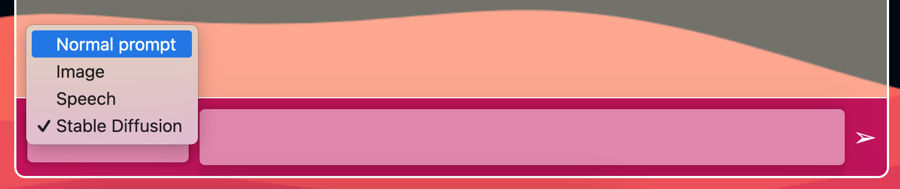
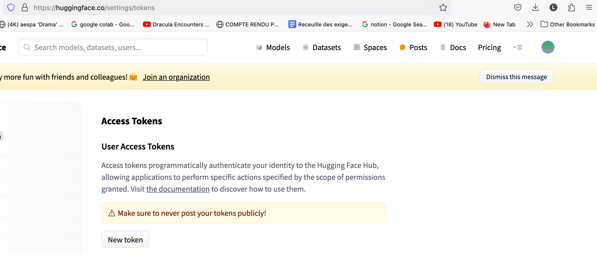

# Projet Mini Chatbot IA

## Membres
- Tuan Linh Dao
- TRINH Thi Thanh Thuy

## À propos du chatbot
Notre chatbot peut effectuer quatre fonctions. Vous pouvez choisir la fonction souhaitée en cliquant sur le rectangle à côté de l'espace où vous entrez votre prompt :


1. **Répondre aux prompts de texte normal**:<br>
Vous pouvez poser vos questions.
2. **Génération d'images en utilisant le modèle "Dall E" développé par OpenAI**:<br>
Le prompt transféré doit commencer par `/image...`.
3. **Génération d'images en utilisant le modèle [stable-diffusion-v1-4](https://huggingface.co/CompVis/stable-diffusion-v1-4) développé par Robin Rombach et Patrick Esser** :<br> 
Le prompt transféré doit commencer par `/stable-diffusion...`.
4. **Génération de réponses vocales** :<br>
Le prompt transféré doit commencer par `/speech...`.

## Les clés API dans ce projet
### Clés API utilisées
Nous avons utilisé deux clés API pour générer les images dans ce projet :
1. La clé API d'OpenAI fournie par M. Michel Buffa et M. Michel Winter.
2. La clé API pour le modèle [stable-diffusion-v1-4](https://huggingface.co/CompVis/stable-diffusion-v1-4).

### Comment obtenir la clé API pour le modèle Stable Diffusion
Pour obtenir cette clé, suivez les étapes suivantes :
1. Créez un compte sur [Hugging Face](https://huggingface.co/).
2. Créez votre clé API en visitant [ce lien](https://huggingface.co/settings/tokens) comme illustré dans l'image ci-dessous :
 

## Tester le projet
Pour tester notre projet, suivez ces étapes :

1. Clonez notre projet en utilisant la commande :
    ```sh
    git clone https://github.com/Linhkobe/AI-Chatbot.git
    ```

2. Configurez les clés API dans votre environnement :
    - D'abord, naviguez vers le répertoire "server" du projet :
        ```sh
        cd server
        ```
    - Ouvrez le fichier `.bashrc` en utilisant :
        ```sh
        code ~/.bashrc 
        ```
    - Ajoutez les clés API comme indiqué ci-dessous, puis sauvegardez le fichier avec `Ctrl+S` :
        ```sh
        export OPENAI_API_KEY="VOTRE_OPENAI_API_KEY"
        export HUGGING_FACE_API_KEY="VOTRE_HUGGING_FACE_API_KEY"
        ```
    - Sauvegardez ces clés en exécutant :
        ```sh
        source ~/.bashrc
        ```

3. Démarrez le serveur :
    - Naviguez vers le répertoire "server" :
        ```sh
        cd server
        ```
    - Exécutez les commandes suivantes respectivement:
        ```sh
        npm install
        npm start
        ```

4. Démarrez l'interface du chatbot :
    - Installez l'extension Live Server si vous ne l'avez pas.
    - Cliquez sur "Go Live", et l'interface s'ouvrira automatiquement dans votre navigateur.

## Démonstration du chatbot
Vous pouvez cliquer l'image suivante pour voir la démo :
[](https://www.youtube.com/watch?v=iSgwS_wpUEk)
